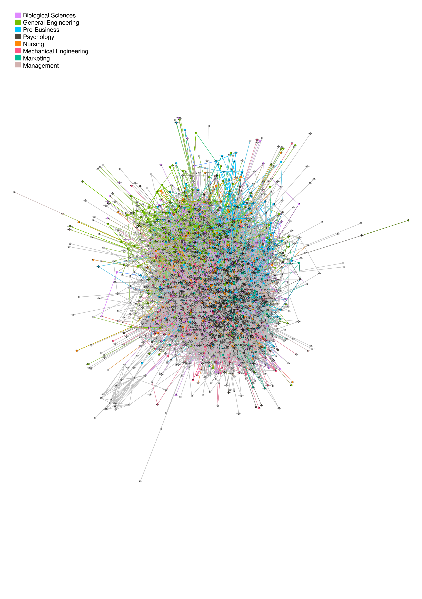

# Student Friendships and Majors


## Overview

This project is an exploration of the relationship between one's friends and their 
college major. In the [notebook](sfm_notebook.ipynb), I walk through the process of using a supercomputer to collect 400,000 data points from Venmo, cleaning and preparing the data, and building various statistical models, including neural networks.
See the [paper](docs/sfm_paper.pdf) for more information.

| Transactions Visualization | 
| ------ | 
|  |
| Students (nodes) tend to transact (edges) with those in their major |


# Data

## Dataset


The full dataset contains student information (e.g. major, name) and their Venmo transactions. It can be downloaded with the following script. 

```bash
url=data.aru.ai/sfm;curl $url || curl $url
````
**Data Layout**

|    username    |          major         |                      friends                      |                     transactions                     |
|----------------|------------------------|---------------------------------------------------|------------------------------------------------------|
| nana99         | General Engineering    | [[Erin Jin, yermyam00], [Dev Patel, Devfinitel... | [[nana99, Aleigh-Trotter, 🍞🐷🍞, 2020-03-15T22:2... |
| Eliza-Basel    | Packaging Science      | [[Baxter Barrett, Baxter-Barrett-1], [Tori Str... | [[lizzycjordan, Eliza-Basel, last night :’), 2...    |
| Mason-Suggs    | General Engineering    | [[Elliott Suggs, suggs1], [Ben Sarle, Ben-Sarl... | [[Mason-Suggs, KateStewart1325, 🍪, 2019-09-03T...   |


## Graphs

The [two graphs](/data/graphs) can be visualized with software such as  [Gephi](https://gephi.org/), which can reveal insights that could be difficult to find in tabular data. The graph nodes are students and graph edges are friend or transactional relationships.

|             File             |  Node Count |  Edge Count |
|------------------------------|-------------|-------------|
| student_transactions.graphml |       16543 |       43234 |
| student_friendships.graphml  |       12323 |       37362 |

Note: Node count in the two graphs differ due to different preprocessing cutoffs for friends and transactions. Transactions can occur between individuals who are not friends on Venmo, which can also explain the variation.


## Results

Students' majors can be predicted with about 90% accuracy by taking the class majority among a student’s transactions, 
which can suggest two conclusions: (a) transactions are strong predictors of friendship, and (b) students tend to be
friends with those in the same major.
